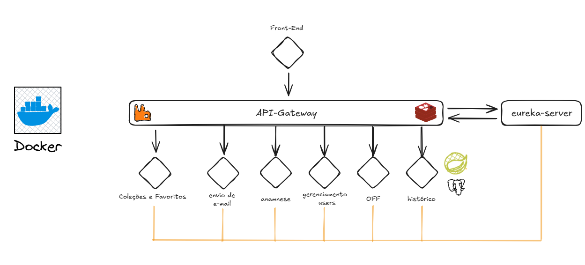

# Come-come BackEnd

Essa é a instância do BackEnd para o aplicativo Mobile **Come-come**, focado na análise nutricional de cada usuário. A aplicação já está dockerizada e aplicada para ser mais portátil possível para desenvolvimento.

---

## Tecnologias Utilizadas

- **Java / Spring Boot**  
- **Spring Cloud Gateway**  
- **Spring Security**
- **Docker & Docker Compose**
- **RabbitMQ** (Mensageria Assíncrona)
- **Swagger UI** para documentação da API  
- **Open Food Facts API** (integração externa)
- **Azure Blob Storage** (Salvar perfis em uma nuvem específica)
- **Brevo API** (Envio de emails)

---

## Estrutura dos Serviços

| Serviço                   | Descrição                                                                                             | Porta Interna | Endpoint via Gateway                |
|---------------------------|-------------------------------------------------------------------------------------------------------|---------------|-------------------------------------|
| **gateway-service**       | API Gateway que redireciona requisições para os microsserviços                                        | 8083          | http://localhost:8083               |
| **openfoodfacts-service** | Serviço de integração com a API pública Open Food Facts                                               | 8082          | http://localhost:8083/openfoodfacts |
| **cadastro-service**      | Serviço responsável por cadastro e login de usuários                                                  | 8081          | http://localhost:8083/cadastro      |
| **anamnese-service**      | Serviço de gerenciamento de anamneses (histórico do paciente)                                         | 8084          | http://localhost:8083/anamnese      |
| **historico-service**     | Serviço relacionado com o histórico de busca do usuário                                               | 8085          | http://localhost:8083/historico     |
| **email-service**         | Serviço responsável pelo envio de emails para os usuários                                             | 8086          | http://localhost:8083/email         |
| **favorite-service**      | Serviço responsável por salvar alimentos favoritos do usuário, como também suas coleções de alimentos | 8087          | http://localhost:8083/favorite      |

### Arquitetura


---

## Endpoints Principais

| Tipo                          | Endpoint                                                                         | Descrição                                              |
|-------------------------------|----------------------------------------------------------------------------------|--------------------------------------------------------|
| **Swagger**                   | [`http://localhost:8083/swagger-ui.html`](http://localhost:8083/swagger-ui.html) | Interface de documentação dos endpoints                |
| **Open Food Facts**           | [`http://localhost:8083/openfoodfacts`](http://localhost:8083/openfoodfacts)     | Integração com API pública de informações nutricionais |
| **Gerenciamento de Usuários** | [`http://localhost:8083/cadastro`](http://localhost:8083/cadastro)               | CRUD de usuários e autenticação                        |
| **Anamnese**                  | [`http://localhost:8083/anamnese`](http://localhost:8083/anamnese)               | Gestão de anamnese (dados de saúde e histórico)        |
| **Histórico**                 | [`http://localhost:8083/historico`](http://localhost:8083/historico)             | Histórico de busca do usuário                          |
| **Email**                     | [`http://localhost:8083/email`](http://localhost:8083/email)                     | Envio de emails                                        |
| **Favoritos**                 | [`http://localhost:8083/favorite`](http://localhost:8083/email)                  | Coleção de alimentos e favoritos                       |

---

## Execução com Docker Compose

### Passo 1 - Build e Inicialização

Para construir e subir todos os containers da aplicação, execute:

```bash
# Após isso, vai demorar cerca de 3-4 minutos para baixar todas as dependências, então pode ficar esperando um pouco :)
docker-compose up --build
